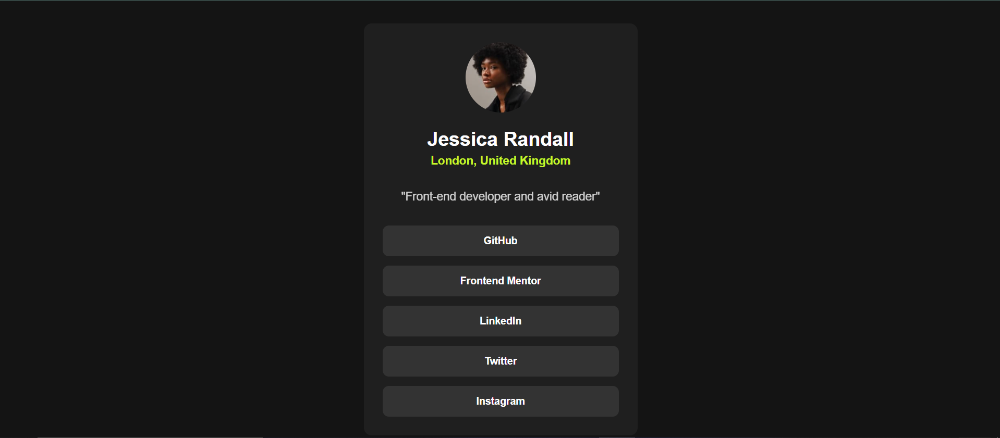

# Frontend Mentor - Social links profile solution

This is a solution to the [Social links profile challenge on Frontend Mentor](https://www.frontendmentor.io/challenges/social-links-profile-UG32l9m6dQ). This challenge helped me practice building a simple, responsive profile card with interactive elements.

## Table of contents

- [Overview](#overview)
  - [The challenge](#the-challenge)
  - [Screenshot](#screenshot)
  - [Links](#links)
- [My process](#my-process)
  - [Built with](#built-with)
  - [What I learned](#what-i-learned)
  - [Continued development](#continued-development)

## Overview

### The challenge

Users should be able to:

- View a responsive social profile card
- See hover and focus states for all interactive elements on the page

### Screenshot



### Links

- Solution URL: [GitHub URL](https://github.com/shina-wq/social-links-card)
- Live Site URL: [Live site URL](https://shina-wq.github.io/social-links-card/)

## My process

### Built with

- Semantic HTML5 markup
- CSS custom properties
- Flexbox for layout
- Mobile-first workflow

### What I learned

This project helped me practice structuring a simple profile page with interactive buttons. I also improved my understanding of hover states, flexbox for layout, and CSS transitions.

Here’s an example of how I added a smooth hover effect to buttons:

```css
button {
    background-color: hsl(0, 0%, 20%);
    color: white;
    padding: 12px;
    border: none;
    border-radius: 8px;
    transition: all 0.15s ease-in-out;
}

button:hover {
    background-color: hsl(75, 94%, 57%);
    color: black;
}
```

### Continued development

In future projects, I want to:

Experiment with CSS animations for smoother interactions
Improve accessibility by adding ARIA labels and keyboard navigation
Use JavaScript to make the links dynamic (e.g., open in new tabs).